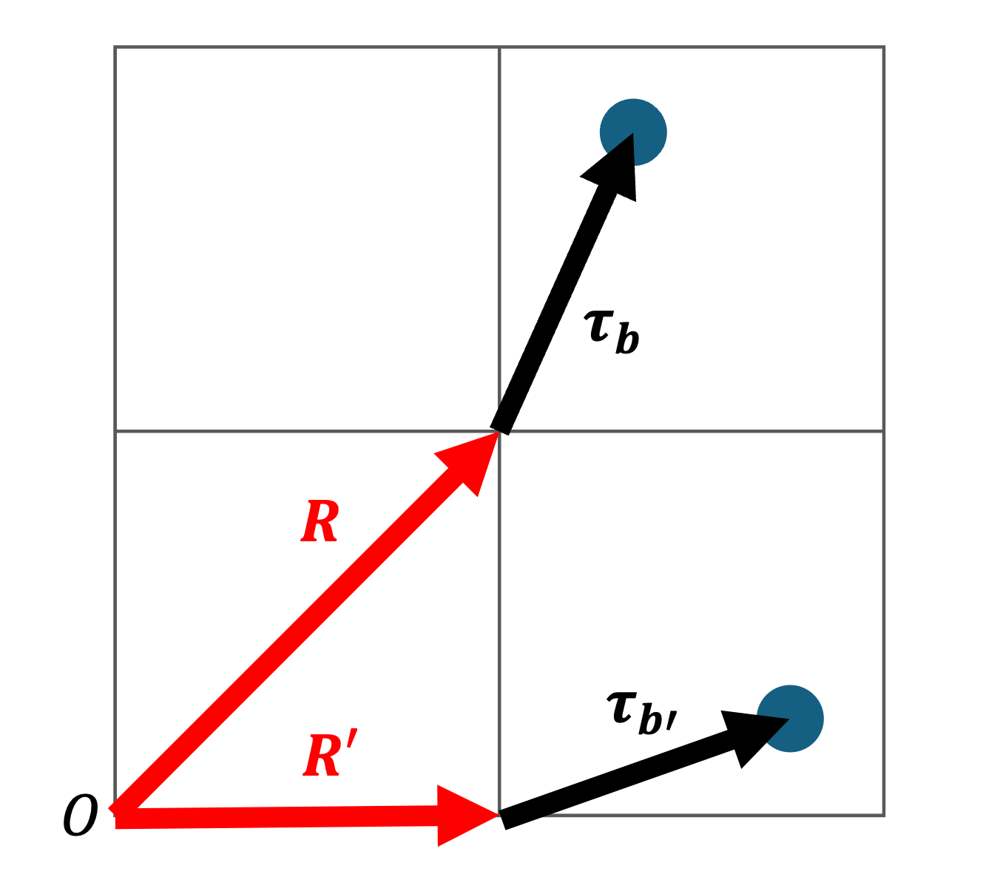

Definitions and Conventions
===========================

Complex numbers
---------------

When not a subscript, :math:`i` is the imaginary number equal to :math:`\sqrt{-1}`.

:math:`\overline{A}` is the complex conjugate of :math:`A`.

:math:`A^\dagger` is the Hermitian adjoint of :math:`A`.

Indices
-------

* :math:`i,j` are general atom indices.
* :math:`b,b'` are the indices of atoms in the unit cell only, running from zero to :math:`N` the number of atoms in the unit cell.
* :math:`\alpha,\alpha'` are Cartesian indices :math:`x,y,z`.
* Greek letters are indices over a block matrix in compact notation. They run from zero to :math:`2N`.

Structure
---------

The lattice cell is represented by a :math:`3 \times 3` array of basic vectors :math:`\mathbf{a}_1, \mathbf{a}_2, \mathbf{a}_3` like

.. math::

   A = \begin{pmatrix}
   a_1^x & a_1^y & a_1^z \\
   a_2^x & a_2^y & a_2^z \\
   a_3^x & a_3^y & a_3^z \\
   \end{pmatrix}

Atom positions are given either in Cartesian coordinates :math:`\mathbf{x}`, which means their position with respect to the x,y and z Cartesian axes, or in scaled coordinates :math:`\tilde{\mathbf{x}}`, in terms of
the lattice vectors. The Cartesian and scaled coordinates are related by

.. math::

   \mathbf{x} = A^T \tilde{\mathbf{x}}

Similarly, points in reciprocal space may be represented as Cartesian coordinates or scaled coordinates with respect to the basic
vectors of the reciprocal lattice.

This is in keeping with ASE's conventions.

Magnetic moments and spins
--------------------------

Magnetic moments :math:`\mu` are usually given in units of :math:`\mu_B` (the Bohr magneton). Spin angular momentum :math:`S` is usually given in
units of :math:`\hbar`. In these units, the magnitudes are related by :math:`\mu = 2S\mu_B`. When reading files with magnetic data, by default Magnon assumes
magnetic moments are being provided. To instead read spin quantum numbers, a scaling of :math:`2` may be applied.

Rotation matrices are labelled :math:`Q`. Their column vectors are labelled :math:`\mathbf{q}_1`, :math:`\mathbf{q}_2`, :math:`\mathbf{q}_3`.

The vector :math:`\mathbf{v} = \mathbf{q}_3` gives the direction of a magnetic moment. The vector :math:`\mathbf{u}=\mathbf{q}_1+i\mathbf{q}_2` is a complex linear superposition
of two vectors orthogonal to the spin direction. This form is chosen to allow simpler rewriting of the Hamiltonian when substituting the ladder operators.

Cells and vectors
-----------------

   *Figure 1. Splitting vectors into a lattice vector part and a remainder part.*

We represent the position vector from the global origin to an atom as the sum of two parts, as shown in Figure 1:

* :math:`\mathbf{R}` - a lattice vector from the global origin to the local origin of the cell containing the atom
* :math:`\boldsymbol{\tau}_b` - a vector from the local origin to the atom labelled by index :math:`b`

Exchange coupling data
----------------------

The site indices may start at 0 or 1. By default, this is 1. The interaction vector is a scaled vector between the two interacting sites.
However, inside MagnonSpectrum, we use the Cartesian cell vector :math:`\mathbf{R}`.

:math:`J` is the exchange coupling tensor, while :math:`\tilde{J}` is a rotated exchange coupling tensor due to some nontrivial Q-commensurate magnetic ordering.

Reciprocal space
----------------

A point in reciprocal space is known as a 'k-point' or a 'wavevector' and is denoted by the vector :math:`\mathbf{k}`.

To follow conventions for the labelling of high-symmetry points, refer to `SeeK-path <https://www.materialscloud.org/work/tools/seekpath>`__.

Primitive cells
---------------

Primitive cells are standardized using Spglib to remove unconventional rotations which would otherwise insert ambiguity into
the definitions of the high-symmetry points.

Quantum Mechanics
-----------------

An operator is denoted using a 'hat'. This means that :math:`S^x` is a dynamical variable, and :math:`\hat{S}^x` is the corresponding operator.

The commutator between two operators is denoted by square brackets, :math:`[\hat{A}, \hat{B}] = \hat{A}\hat{B} - \hat{B}\hat{A}`

Magnon creation and annihilation operators are denoted by :math:`\hat{b}^\dagger, \hat{b}` respectively.

:math:`\ket{\psi}` and :math:`\psi` both represent a quantum state in different notation.

:math:`\delta` is the identity matrix with all entries zero except on the diagonal, whose elements are one.

:math:`\tilde{\delta}` is the paraidentity matrix. It is equal to the identity, but it is :math:`+1` for :math:`\rho <= N` and
:math:`-1` for :math:`\rho > N`.

Hamiltonian prefactor
---------------------

The Heisenberg Hamiltonian in Magnon is defined as a sum over all pairs of indices and double-counting is then removed
by multiplying by :math:`0.5`. This is then multiplied by a prefactor which by default is :math:`2`, but this may be changed by
the user when initializing the :code:`MagnonSpectrum` object.

Unit vs dimensionful spins
--------------------------

It is also common to use a model in which the spin vectors are replaced by unit vectors,

.. math::

   H = -\frac{1}{2}\sum_{\mathbf{R},\mathbf{R'}} \sum_{b,b'} \sum_{\alpha, \alpha'} \hat{s}^{\alpha}_{\mathbf{R}b} j^{\alpha\alpha'}_{\mathbf{R}n\mathbf{R'}b'} \hat{s}^{\alpha'}_{\mathbf{R'}b'}

In this case, the magnitude of the spin angular momentum is absorbed into a redefined exchange coupling :math:`j`. This means that
exchange coupling values derived based on this model will be different to those derived using dimensionful spins.
The Hamiltonian in Magnon uses a dimensionful spin model. There is then a conversion applied to each element of the
Hamiltonian to account for the couplings being defined within the unit model. By default, this conversion is turned on. When turned on, a conversion factor of

.. math::

   \frac{2}{\sqrt{S_{\mathbf{R}b} S_{\mathbf{R'}b'}}}

will be applied to each element of :math:`J_{\mathbf{R}b\mathbf{R'}b'}`.