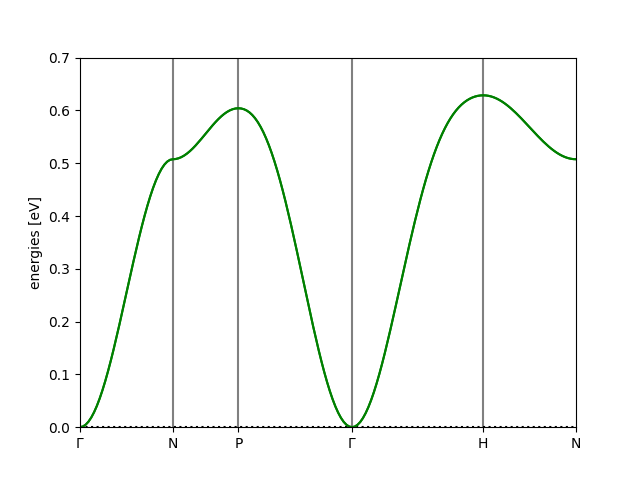

Magnon Bandstructures in Python
=======================================

**Magnon** is a Python library integrated with ASE for fast and accurate simulations of linear spin-wave theory band structures. The code is versatile and applicable to a broad range of magnetic systems, including: collinear and non-collinear materials, systems with Q-commensurate magnetic ordering, and cases where the exchange coupling includes off-diagonal Cartesian components such as the Dzyaloshinskii-Moriya interaction (DMI) and Kitaev interactions. The library includes a set of propedeutically structured tutorials, and a self-explanatory API that can be straightforwardly integrated into computational workflows to simulate magnon properties with quantitative accuracy.

Bandstructures in under 10 lines of code
----------------------------------------

It is straigthforward to take exchange coupling data from the literature and reproduce the corresponding magnon bandstructure.
Using Magnon, the simple script below can be used to obtain the bandstructure of BCC iron.

.. code-block::

   import magnon

   atoms, interactions = magnon.input.create_interacting_system('Iron_BCC.poscar', 'Iron_BCC_mag_moments', 'Iron_BCC_exchange', 2)

   interactions = interactions.symmetrize(atoms)
   primitive_atoms, primitive_interactions, _ = magnon.build.build_primitive_cell(atoms, interactions)

   spectrum = magnon.MagnonSpectrum(primitive_atoms,primitive_interactions,num_threads=4)

   path = primitive_atoms.get_cell().bandpath(path='GNPGHN', npoints=180)

   bstruct = spectrum.get_band_structure(path)
   bstruct.plot(emin=0, emax=0.7, filename='Iron_BCC_bands.png')

   The bandstructure of BCC Iron calculated using the above example script.

Why use Magnon?
---------------

The core features of Magnon are:

* **Easy to use** - Magnon bandstructures can be computed using less than 10 lines of Python code.
* **Scalable** - Handles arbitrarily-complex atomistic structures using an efficient description of exchange couplings and symmetries.
* **Integrated** - Interfaces with tools such as the Atomic Simulation Environment (ASE) to accelerate scientific workflows. The MagnonSpectrum class introduced in Magnon mirrors the widely-used ASE Phonons class.
* **Adaptable** - Allows conventions for working with dimensionless or dimensional magnetic moments, different Hamiltonian conventions, and many standard input formats.
* **Open** - Built for collaboration.

The code offers:

* ASE-enabled reading of many widely-used atomic structure file formats
* The ability to read exchange interaction data, and inspect their symmetries
* The option to easily augment non-magnetic atomic structure files with a magnetic moment data file
* A rapid set-up routine by simultaneously reading structural, magnetic and exchange-coupling data
* The powerful InteractionList class for working efficiently with exchange coupling data at scale
* In-built symmetrisation routines for generating full exchange couplings from a minimal description
* Standardisation of couplings from arbitrary unit cells to standardized primitive cell
* Support for ferromagnetic, antiferromagnetic, and non-collinear spin configurations
* Support for multiple standard conventions for describing the Heisenberg Hamiltonian
* The ability to convert between exchange couplings used within linear spin wave theory and semiquantum spin dynamics
* An integrated MagnonSpectrum class for easy generation of reciprocal space paths and their bandstructures. Built with the same structure as the ASE Phonons class.

Contents
----------

.. toctree::
   :maxdepth: 2

   install
   theory/index
   tutorials/index
   autoapi/index
   parallelization
   tips
   conventions
   development
   references
   credit
