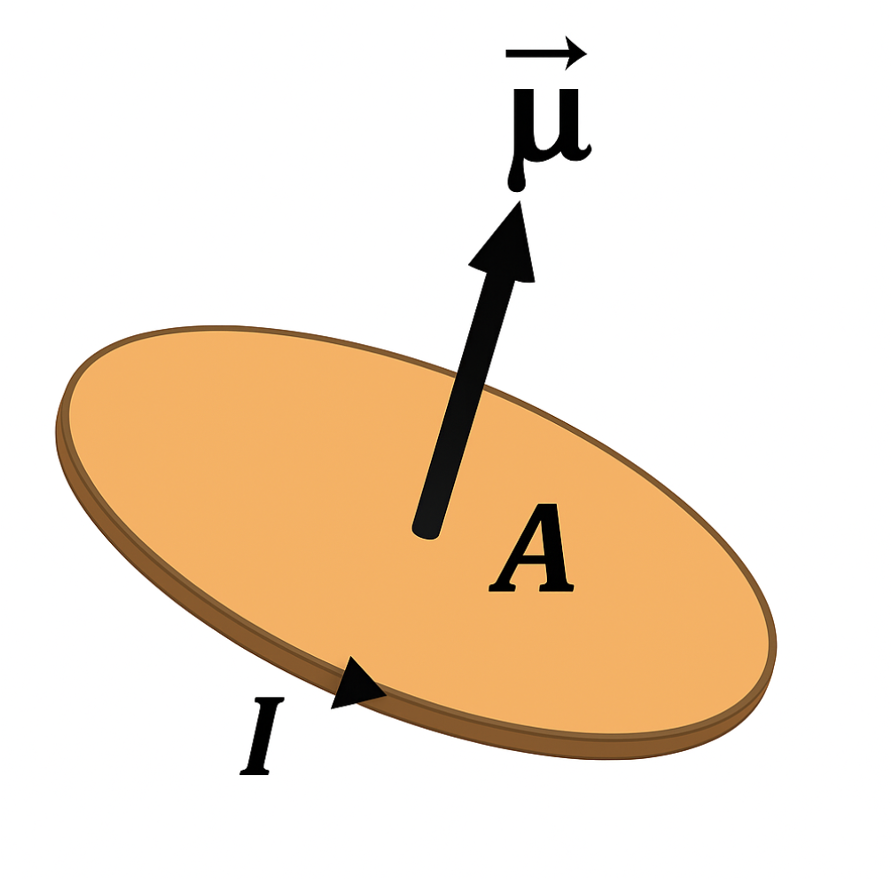

Background
===========

In this section we cover the undergraduate-level theory needed to understand the fundamental, quantum-mechanical origin of the Linear Spin Wave Hamiltonian, following the order below:

* orbital and spin angular momentum of electrons
* connection between angular momentum and magnetic moments
* quantum-mechanical spin operators and their properties
* symmetries of multiple spin states
* the Heisenberg Hamiltonian

Introduction to magnetic moments
--------------------------------

Magnetic atoms are those with nonzero **magnetic moment**; the magnetic moment of an atom determines the strength of the magnetic field it exerts, as well as the torque it experiences when immersed in an external magnetic field.

The magnetic moment is a vector property, therefore magnetic moments are represented as arrows drawn on atoms.

We start by examining the physical origins of the magnetic moments of atoms.

Electron orbital angular momentum
+++++++++++++++++++++++++++++++++

There are two sources of magnetic moment in atoms. The first is the **orbital angular momentum** of the electrons, i.e., the momentum associated with the electron moving within the regions permitted by a given quantum-mechanical orbital. 

To understand the origin of the electronic orbital angular momentum, we start considering a classical charged particle moving at constant velocity along a circular orbit.
The magnitude of the magnetic moment is determined by: :cite:`griffiths_EM`

1. The rate at which the electron orbits the atom, which is effectively an electric current.
2. The size (radius) of the orbit.

   *In classical physics, the magnetic moment associated with an orbiting charge is a vector whose magnitude is proportional to the product of the current it generates and the area enclosed by its orbit.*

For an electron orbiting an atom once every :math:`T` seconds at a distance :math:`r` with velocity :math:`\mathbf{v}` (of modulus :math:`v`), the magnitude of the current is

.. math::
   :label: electron_orbits_current

   I = \frac{e}{T} = \frac{ev}{2\pi r}

with :math:`e` the electron charge. The area enclosed is :math:`\pi r^2`, so the magnetic moment :math:`\boldsymbol{\mu}` due to the orbital motion is

.. math::
   :label: electron_orbits_moment

   \boldsymbol{\mu} = I\mathbf{A}= \frac{e\mathbf{r}\times\mathbf{v} }{2}.

The orbital angular momentum is defined as :math:`\mathbf{L} = m \mathbf{r}\times \mathbf{v}`, so

.. math::
   :label: electron_orbits_moment_L

    \boldsymbol{\mu}= \frac{e}{2m} \mathbf{L}.

So far we have focused on a classical charged particle. The quantum-mechanical description of the electron angular momentum requires quantum-mechanical operators, which have eigenvalues that are quantized, integer multiples of the reduced Planck constant :math:`\hbar`. Therefore, the magnetic moment is also quantized, and conveniently described using the **Bohr magneton** unit,

.. math::
   :label: bohr_magneton

   \mu_B = \frac{e\hbar}{2m},

where :math:`m` is the electronic mass. Then, the magnetic moment is a multiple of this unit,

.. math::
   :label: electron_orbit_mu_bohr_magneton

   \boldsymbol{\mu} = \tilde{\mathbf{L}}\mu_B,

where :math:`\tilde{\mathbf{L}}` is the dimensionless angular momentum vector. Often in the literature the tilde is omitted.

In summary, we have seen that when an electron orbits an atom, its orbital motion generates a magnetic field which we quantify in terms of a magnetic moment. 
In the next section, we will see that this is not the only source of angular momentum within the atom. There also exists an intrinsic ‘spin’ angular momentum, which has a quantum-mechanical origin and no classical counterpart.

Spin
++++

In 1922 Stern and Gerlach proved experimentally that electrons have an additional, intrinsic **spin angular momentum** :cite:`griffiths_QM` that is not associated with their orbital motion.  

.. note::

   The name 'spin' was established by early proposals which suggested that the newly-discovered angular momentum came from the electron spinning about some axis, like a spinning top. This is now known not to be the case, as it would require the surface of the electron to move faster than the speed of light!

The spin angular momentum leads to a magnetic moment too, with a similar (but modified) form,

.. math::
   :label: spin_moment

   \boldsymbol{\mu} = g\textbf{S}\mu_B,

where :math:`\textbf{S}` is the spin angular momentum. :math:`g` is the **spin g-factor**, which is approximately :math:`2`. The appearance of this additional factor is not too surprising; our original choice of unit, the Bohr magneton, was derived by considering orbiting electrons - but the spin angular momentum has nothing to do with orbits, so there is no reason why it should be similarly expressed as a straightforward multiple only of :math:`\mu_B`.

.. note::

   It is common to refer to either a 'magnetic moment' or a 'spin' when discussing the magnetic properties of atoms. Both are vectors pointing in the same direction - the only difference is their magnitude, and physical units.

We are now familiar with magnetic moments, and in Magnon we focus on the moment due to spin angular momentum only. But
to model the spin angular momentum accurately, we need to switch to the quantum mechanical formalism for magnetic moments.

Spin in quantum mechanics
--------------------------

We now associate each component of the spin angular momentum with a quantum mechanical operator, which has three Cartesian components denoted by
:math:`\hat{S}^{x}`, :math:`\hat{S}^{y}` and :math:`\hat{S}^{z}`.

Commutator
++++++++++++

The most fundamental properties of spin angular momentum operators in quantum mechanics are their **commutation relations**,

.. math::
   :label: spin_commutators

   \begin{aligned}
       \left[\hat{S}^x, \hat{S}^y\right] &= i\hbar \hat{S}^z \\
       \left[\hat{S}^y, \hat{S}^z\right] &= i\hbar \hat{S}^x \\
       \left[\hat{S}^z, \hat{S}^x\right] &= i\hbar \hat{S}^y
   \end{aligned}.

The derivation of these commutation relations is discussed in many quantum mechanics textbooks, see e.g. *J. J. Sakurai and J. Napolitano, Modern Quantum Mechanics, 2ed, Addison-Wesley Pearson 2011*.
We also note that the commutation relations for the spin operators are analogous to those satisfied by the orbital angular momentum (see e.g. *H. Georgi, LIE ALGEBRAS IN PARTICLE PHYSICS, Westview Press 1999* for details), and the latter can be directly derived by writing the orbital angular momentum in terms of position and momentum operators, :math:`\hat{\mathbf{L}} = \hat{\mathbf{r}} \times \hat{\mathbf{p}}`, and then explicitly computing the commutators in term of the standard canonical commutation relation  :math:`[{r}_i , p_j]=i\hbar\delta_{i,j}`.

These commutation relations mean that any two components of the spin angular momentum are not simultaneously well-defined.

Total Spin operator
+++++++++++++++++++++++++++++++

We also define the operator

.. math::
   :label: spin_total_operator

   \hat{\mathbf{S}}^2 = (\hat{S}^x)^2 + (\hat{S}^y)^2 + (\hat{S}^z)^2,

and it is easily shown that this commutes with each of the operators for the x-,y- and z-components.

Ladder operators
++++++++++++++++

Define the ladder operators

.. math::
   :label: spin_ladder_operators

   \hat{S}^{\pm} = \hat{S}^x \pm i\hat{S}^y.

We will use this to understand the eigenstates of :math:`\hat{\mathbf{S}}^2` and :math:`\hat{S}^z` and their corresponding
quantum numbers.

Quantum number #1: :math:`m`
++++++++++++++++++++++++++++

The quantum number :math:`m` corresponds to the measurement of a component of the spin along some fixed reference axis,
henceforth taken as the z-axis. We consider a state :math:`\ket{m}` which is an eigenstate of :math:`\hat{S}^z` with eigenvalue :math:`m\hbar`. Using the commutators,

.. math::
   :label: spin_m_number

   \hat{S}^{z} \hat{S}^{\pm} \ket{m} = (m\pm 1) \hat{S}^{\pm} \ket{m},

so that the states :math:`\hat{S}^{\pm} \ket{m}` may be identified with new states :math:`\ket{m\pm1}`, and it is clear that
the operator :math:`\hat{S}^{+}` (:math:`\hat{S}^{-}`) increases (decreases) the eigenvalue of :math:`\hat{S}^z` by one quantum of spin angular momentum, with the peculiarities discussed below.

Quantum number #2: :math:`s`
+++++++++++++++++++++++++++++

The spin angular momentum is finite, so there must be an upper and lower bound on the eigenvalues the z-component of spin may adopt.
We will therefore consider the state :math:`\ket{s}`, where :math:`s\hbar` is the maximum z-component of spin angular
momentum.

Because this is the maximum value, applying :math:`S^+` should destroy this state and give zero. Using the relations above,

.. math::
   :label: spin_s_plus_s_minus

   \hat{S}^-\hat{S}^+ = \hat{\mathbf{S}}^2 - (\hat{S}^z)^2 + \hbar\hat{S}^z.

Applying this to :math:`\ket{s}`, the left-hand side is zero because this is the maximum value allowed and further application
of :math:`S^+` destroys the state. Then

.. math::
   :label: spin_s_quantum_number

   \hat{\mathbf{S}}^2\ket{s} = \hbar s(s+1)\ket{s}.

Eigenspectrum
++++++++++++++

The spin angular momentum states are defined by the quantum numbers :math:`s` and :math:`m`:

* :math:`s` is fixed by the species of particle. For example, electrons have :math:`s = \frac{1}{2}`.
* :math:`m` determines the z-component of the spin angular momentum, and may take values from :math:`-s` to :math:`+s`

.. note::

   Notice that the z-component can never be equal to the length of the spin angular momentum vector (:math:`S^z_{max} = s\hbar < s(s+1)\hbar`) under the quantisation.
   This is necessary to satisfy the uncertainty relations above. If it could be equal, all components would be deterministic; :math:`S^z` would be equal to the spin of the particle, the other components would be zero.

Multiple spins
++++++++++++++

Consider a state of two spins, which have only :math:`m=\pm\frac{1}{2}`; there are then four unique states:

.. math::
   :label: two_spin_states

   \ket{\uparrow\uparrow}, \ket{\uparrow\downarrow}, \ket{\downarrow\uparrow}, \ket{\downarrow\downarrow},

and we wish to categorise these using the quantum numbers :math:`s` and :math:`m`. Components of angular momentum along
a certain axis are additive, so e.g.

.. math::
   :label: additive_spin_operators

   \hat{S}^z_{tot} = \hat{S}^z_{1} + \hat{S}^z_{2}.

So we can categorise the four states under :math:`m` easily enough.

In quantum mechanics, particles such as electrons are indistinguishable. This means that if we have two electrons, it is not
possible to say which one is which. This symmetry must be reflected in the quantum-mechanical wavefunction when we swap the order of the electrons.
The states :math:`\ket{\uparrow\uparrow}` and :math:`\ket{\downarrow\downarrow}` satisfy this already, but the other two must be replaced by
symmetric linear combinations,

.. math::
   :label: two_spin_states_symmetric

   \frac{1}{\sqrt{2}}\left(\ket{\uparrow\downarrow} + \ket{\downarrow\uparrow}\right)

   \frac{1}{\sqrt{2}}\left(\ket{\uparrow\downarrow} - \ket{\downarrow\uparrow}\right).

When assigning :math:`s` quantum numbers, it is clear that :math:`\ket{\uparrow\uparrow}` and :math:`\ket{\downarrow\downarrow}` must correspond to
:math:`s = 1` since :math:`m = 1`, and :math:`s > m`. But understanding which of the above two corresponds to :math:`s=0,m = 0` and which one corresponds
to :math:`s=1,m = 0` is more difficult. Rather than applying :math:`\hat{\mathbf{S}}^2` directly, it is easier to consider
that the :math:`\hat{S}^{\pm}` do not change the :math:`s` quantum number, so by applying one of these to either :math:`\ket{\uparrow\uparrow}` or
:math:`\ket{\downarrow\downarrow}` we can find the other states with the same :math:`s` quantum number. In the two-spin example,
it turns out that the :math:`s=1` states are

.. math::
   :label: two_spin_states_s_1

   \ket{\uparrow\uparrow}

   \frac{1}{\sqrt{2}}\left(\ket{\uparrow\downarrow} + \ket{\downarrow\uparrow}\right)

   \ket{\downarrow\downarrow},

leaving

.. math::
   :label: two_spin_states_s_0

   \frac{1}{\sqrt{2}}\left(\ket{\uparrow\downarrow} - \ket{\downarrow\uparrow}\right)

as the only state with :math:`s=0`.

The significant result is that, under **exchange** of spins (i.e. swapping the positions of the first and second arrow),
the first set of states are symmetric (they don't change) and the second set (of one state) is antisymmetric (it is multiplied
by :math:`-1`). This means that there is a clear link between the **symmetry of the spin state** and the **total spin**. We will exploit this
property to great effect in setting up the Heisenberg Hamiltonian.

.. note::

   To see the above result for the more general case, consider that for multiple spins the operators :math:`\hat{S}^x`, :math:`\hat{S}^y`, :math:`\hat{S}^z` are additive
   i.e. :math:`\hat{S}^x = \hat{S}^x_1 + \hat{S}^x_2 + ...`, meaning the :math:`\hat{S}^{\pm}` are additive also. Thus application of
   :math:`\hat{S}^{\pm}` to the top or bottom state to get those inbetween (with the same :math:`s` quantum number) will preserve
   the symmetry or antisymmetry.

Exchange interaction
--------------------

Origins in symmetry
++++++++++++++++++++

The interaction we consider in Magnon is the **exchange interaction**. This is a purely quantum phenomenon, which does not have a classical analogy.

The indistinguishability of electrons requires that the many-electron wavefunction (that depends on particle
positions and spin states) must be antisymmetric when two electrons are exchanged. 
Consider the paradigmatic example of a two-electron wavefunction :math:`\Phi(\mathbf{r}_1,\mathbf{r}_2,s_1,s_2)`, where :math:`\mathbf{r}_1,\mathbf{r}_2` are electron positions, and :math:`s_1,s_2` are spin quantum numbers. Focusing the case where the total wavefunction can be expressed as a direct product of spatial :math:`\psi(\mathbf{r}_1,\mathbf{r}_2)` and spin part :math:`\chi(s_1,s_2)`,

.. math::
   :label: exchange_symmetry_violation

   \Phi(\mathbf{r}_1,\mathbf{r}_2,s_1,s_2)=\psi(\mathbf{r}_1,\mathbf{r}_2)\chi(s_1,s_2),

we see that the antisymmetry of the total wavefunction can originate from having: (i) a symmetric spatial part (:math:`\psi(\mathbf{r}_1,\mathbf{r}_2) = \psi(\mathbf{r}_2,\mathbf{r}_1)`) and an antisymmetric spin part (:math:`\chi(s_1,s_2)=-\chi(s_2,s_1)`), or (ii) an antisymmetric spatial part (:math:`\psi(\mathbf{r}_1,\mathbf{r}_2) = -\psi(\mathbf{r}_2,\mathbf{r}_1)`) and a symmetric spin part (:math:`\chi(s_1,s_2)=\chi(s_2,s_1)`).

Now consider taking, for a pair of spins,

.. math::
   :label: two_spins_total_spin

   (\mathbf{S}_1 + \mathbf{S}_2)^2 = (\mathbf{S}_1)^2 + (\mathbf{S}_2)^2 + 2 \mathbf{S}_1 \cdot \mathbf{S}_2,

which means

.. math::
   :label: two_spins_dot_product

   \mathbf{S}_1 \cdot \mathbf{S}_2 = \frac{1}{2} \left[ (\mathbf{S}_{tot})^2 - (\mathbf{S}_1)^2 - (\mathbf{S}_2)^2 \right],

from which we see that the dot product of two spin vectors depends on the :math:`s` quantum number of the joint spin state (this is the eigenvalue of :math:`(\mathbf{S}_{tot})^2`).
However, we have already showed that:

* this quantum number determines the symmetry of the spin part of the wavefunction (under the exchange of spins),
* to give overall antisymmetry, symmetry of the spatial part must be opposite to that of the spin part,
* the energy of the wavefunction depends on the symmetry of the spin and spatial parts.

**There is a relation between the relative orientation of two spin vectors and the energy of multi-electron wavefunctions.** This underpins the rest of what we will do - the exchange interaction between spins is actually a way of
representing the energy differences between different spatial electron wavefunctions which we 'select' by playing with the directions
of the spin vectors :cite:`blundell2021`.

Heisenberg Hamiltonian
++++++++++++++++++++++

Using the above, we consider pairs of spins and quantify the effect on the energy of changing their relative orientation by the **exchange
interaction parameter** :math:`J`,

.. math::
   :label: basic_heisenberg_hamiltonian

   H = \sum_{\mathbf{R},\mathbf{R'}}\sum_{bb'} J_{\mathbf{R}b\mathbf{R'}b'} \mathbf{S}_{\mathbf{R}b} \cdot \mathbf{S}_{\mathbf{R'}b'},

known as the **Heisenberg Hamiltonian**. The sum runs over all unique pairs of atoms; :math:`b,b'` are indices of the atoms
in the unit cell, and :math:`\mathbf{R},\mathbf{R'}` are indices over cells (labelled by lattice vectors). :math:`J` is the exchange coupling interaction strength,
and taking the dot product between the :math:`\mathbf{S}` quantifies the relative orientation of pairs of spin
vectors.

