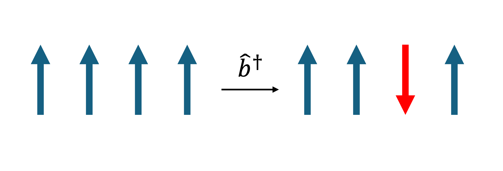

Linear Spin Wave Theory
========================

Heisenberg Hamiltonian
----------------------

General Heisenberg Hamiltonian
+++++++++++++++++++++++++++++++

The starting point to describe magnon excitations is the Heisenberg Hamiltonian written in general form (i.e., before performing any material-specific simplification),

.. math::
   :label: general_heisenberg_hamiltonian

   H = -\frac{1}{2}\sum_{\mathbf{R},\mathbf{R'}} \sum_{b,b'} \sum_{\alpha, \alpha'} \hat{S}^{\alpha}_{\mathbf{R}b} J^{\alpha\alpha'}_{\mathbf{R}b\mathbf{R'}b'} \hat{S}^{\alpha'}_{\mathbf{R'}b'},

where :math:`\mathbf{R}, \mathbf{R'}` are direct lattice vectors, :math:`b,b'` are indices that label magnetic sites with positions :math:`\mathbf{\tau}_b,\mathbf{\tau}_{b'}` in the unit cell, and :math:`\alpha,\alpha'` are the Cartesian indices :math:`{x,y,x}` used to label entries of the vectors :math:`\mathbf{R}+\mathbf{\tau}_b,\; \mathbf{R'}+\mathbf{\tau}_{b'}` (see Fig. 3). :math:`J` is the strength of the exchange coupling interaction in units of energy, and :math:`\hat{S}^{\alpha}` is the quantum-mechanical operator associated with the :math:`\alpha`-component of spin angular momentum, in units of :math:`\hbar`.

.. figure:: R_tau.png
   :figwidth: 400

   *Explanation of the notation used. The position vector of a site is split into the sum of a direct lattice vector, and unit-cell basis vector.*

The inclusion of the :math:`\alpha,\alpha'` indices allows the interaction between spins to be anisotropic and include off-diagonal
components. The simplest case is an identity matrix in these indices, multiplied by the magnitude of the interaction; this corresponds
to the basic form given in the previous section. The most general form of the Heisenberg Hamiltonian allows us to describe the following exchange interactions:

**Direct exchange**
This interaction involves magnetic moments that are sufficiently close in space to have overlapping wavefunctions.
When involving electrons within the same atom or molecule (intra-atomic or molecular), the direct exchange is generally positive and underlies Hund's rule --- i.e., the Coulomb repulsion between electrons generally favours an overall antisymmetric fermionic wavefunction that is spatially antisymmetric and spin symmetric.
In the case of a solid, the direct exchange involves magnetic moments in electrical insulators that are localized on magnetic sites; it can be positive or negative --- in the former case favouring a parallel (ferromagnetic) alignment of the magnetic moments, and in the latter case favouring an antiparallel (antiferromagnetic) alignment of the magnetic moments :cite:`coronadoMolecularMagnetismMolecular1996`.

These direct exchange interactions populate the elements :math:`J_{\mathbf{R}b\mathbf{R}'b'}^{\alpha\alpha}` generally separated by a distance :math:`d= ||\mathbf{R}+\mathbf{\tau}_b-\mathbf{R}-\mathbf{\tau}_{b'}||` which is sufficiently small to allow overlap between wavefunctions.

**Indirect exchange**
This interaction involves magnetic moments that are spatially separated by distances sufficiently large to prevent significant wavefunction overlaps, and their coupling is mediated by an intermediary entity, such as an itinerant electron (RKKY interaction named after Ruderman,
Kittel, Kasuya and Yosida, emerging in metals) or a intermediate nonmagnetic atom (superexchange interaction emerging in electrical insulators).
These indirect interaction terms are also described by couplings :math:`J_{\mathbf{R}b\mathbf{R}'b'}^{\alpha\alpha}`, but involve a separation distance :math:`d= ||\mathbf{R}+\mathbf{\tau}_b-\mathbf{R}-\mathbf{\tau}_{b'}||` larger than in the direct exchange case.

**Kitaev interaction**
This is an anisotropic, bond-directional interaction between spins in 2D honeycomb lattices :cite:`kitaevAnyonsExactlySolved2006`.
Depending on the direction of the bond, the interaction either takes the form :math:`J_{\mathbf{R}b\mathbf{R'}b'}^{xx}S_{\mathbf{R}b}^x S_{\mathbf{R'}b'}^x`,
:math:`J_{\mathbf{R}b\mathbf{R'}b'}^{yy}S_{\mathbf{R}b}^y S_{\mathbf{R'}b}^y` or :math:`J_{\mathbf{R}b\mathbf{R'}b'}^{zz}S_{\mathbf{R}b}^z S_{\mathbf{R'}b'}^z`.

**Dzyaloshinskii-Moriya interaction**
This exchange originates from from the spin-orbit interaction, and it is described by an Hamiltonian involving the vector product between two spin vectors,  :math:`H_{1,2}=\mathbf{D}_{1,2}\cdot[\mathbf{S}_1 \times \mathbf{S}_2]` :cite:`coronadoMolecularMagnetismMolecular1996`.
This interaction populates the elements :math:`J_{\mathbf{R}b\mathbf{R}'b'}^{\alpha\alpha'}` which are off-diagonal i.e. :math:`\alpha\ne\alpha'`

Holstein-Primakoff Transformation
----------------------------------

To describe quantized magnetic excitations, we want to write the Heisenberg Hamiltonian in the formalism of **second quantization**, i.e.,  in terms of **creation and annihilation operators**.

Creation and annihilation operators
++++++++++++++++++++++++++++++++++++

A magnetic excitation is a deviation from a the ground-state spin arrangement --- for example, we show in Fig. 4 an excitation created on top of a ferromagnetic ground state. 

Within the second-quantization formalism, the creation or annihilation of these excitations is described by the following bosonic operators:
* The operator :math:`\hat{b}^{\dagger}_{\mathbf{R}b}` creates a magnetic excitation at the site located at :math:`\mathbf{R}+\boldsymbol{\tau}_b`.
* The operator :math:`\hat{b}_{\mathbf{R}b}` destroys a magnetic excitation at the site located at :math:`\mathbf{R}+\boldsymbol{\tau}_b`.

   Excitation created by the operator :math:`\hat{b}^{\dagger}_{\mathbf{R}b}` on a ferromagnetic ground state.

The creation and annihilation operators are akin to ladder operators, which we have already seen in the discussion of the
spin angular momentum. Here, the creation and annihilation operators act on **number states**, and raise or lower the number of **quasiparticle** excitations in the Fock state by one. Fock states are also called number states, since they are characterizeed by a fixed number
of quasiparticles excitations (in this case these excitations are deviations of the magnetic-moment directions from the ground-state directions).

Magnetic excitations change the spin by :math:`\hbar`, so they are quasiparticles of integer spin, which makes them bosons (fermions have half-integer spin).
The important property of these operators in order that they describe **bosons** is that they must statisfy the bosonic commutation relation

.. math::
   :label: boson_commutation_relations

   \left[\hat{b}_{\mathbf{R}b}, \hat{b}^{\dagger}_{\mathbf{R'}b'} \right] = \delta_{\mathbf{R}\mathbf{R'}}\delta_{bb'}.

From this, we may show directly by action on a **number state** that the operator :math:`\hat{n}_{\mathbf{R}b} = \hat{b}^{\dagger}_{\mathbf{R}b}\hat{b}_{\mathbf{R}b}` can be used to find the number of magnetic excitations present (the **number operator**).

Magnetic excitations
++++++++++++++++++++++

Considering for example a ferromagnetic ground state, corresponding to spins all assuming upward z component, we have that the mimumum magnetic excitation will correspond to flipping one single spin component from upward to downward direction, reducing the :math:`m` quantum number by one.

Holstein and Primakoff :cite:`holstein1940` addressed the non-trivial problem of defining spin raising and lowering operators that enable to explore the Fock space 

.. math::
   :label: holstein_primakoff

   \hat{S}^{+}_{\mathbf{R}b} = \sqrt{2 S_{\mathbf{R}b}} \left( 1 - \frac{\hat{b}^{\dagger}_{\mathbf{R}b}\hat{b}_{\mathbf{R}b}}{2 S_{\mathbf{R}b}} \right)^{\frac{1}{2}} \hat{b}_{\mathbf{R}b}

   \hat{S}^{-}_{\mathbf{R}b} = \sqrt{2 S_{\mathbf{R}b}} \hat{b}^{\dagger}_{\mathbf{R}b} \left( 1 - \frac{\hat{b}^{\dagger}_{\mathbf{R}b}\hat{b}_{\mathbf{R}b}}{2 S_{\mathbf{R}b}} \right)^{\frac{1}{2}}

where it can be shown that this transformation satisfies the commutation relations :math:`[\hat{S}^{+}_{\mathbf{R}b},\hat{S}^{-}_{\mathbf{R'}b'} ]= 2\hbar \hat{S}^z_{\mathbf{R}b}\delta_{\mathbf{R},\mathbf{R'}}\delta_{b,b'}` and :math:`[\hat{S}^{z}_{\mathbf{R}b},\hat{S}^{\pm}_{\mathbf{R'}b'} ]=\pm \hbar \hat{S}^{\pm}_{\mathbf{R}b}\delta_{\mathbf{R},\mathbf{R'}}\delta_{b,b'}`

These commutation relations imply that the number of quasiparticles excitations that we can have at each site is limited to :math:`2 S_{\mathbf{R}b}`. The z-component of spin can be written as:

.. math::
   :label: holstein_primakoff_z

   \hat{S}^z_{\mathbf{R}b} = S_{\mathbf{R}b} - \hat{b}^{\dagger}_{\mathbf{R}b}\hat{b}_{\mathbf{R}b} = S_{\mathbf{R}b} - \hat{n}_{\mathbf{R}b}.

where we defined the number operator :math:`\hat{n}_{\mathbf{R}b}= \hat{b}^{\dagger}_{\mathbf{R}b}\hat{b}_{\mathbf{R}b}`. 
If the perturbation to the ground state is small, so that the expected number of excitations satisfies

.. math::
   :label: holstein_primakoff_approx_condition

   \frac{n_{\mathbf{R}b}}{2 S_{\mathbf{R}b}} \ll 1,

then we may use the binomial approximation on the bracket to obtain

.. math::
   :label: holstein_primakoff_approx

   \hat{S}^{+}_{\mathbf{R}b} = \sqrt{2 S_{\mathbf{R}b}}  \hat{b}_{\mathbf{R}b}

   \hat{S}^{-}_{\mathbf{R}b} = \sqrt{2 S_{\mathbf{R}b}} \hat{b}^{\dagger}_{\mathbf{R}b},

This common linear approximation underlies **linear spin wave theory**, it breaks the commutation relations for the spin components, but the perturbation to the ground state is small enough for this to have a negligible effect.
This is analogous to considering the commutation of rotations in 3D space; the smaller the size of the rotations, the less important
the order in which they are applied will be.

We will see later that this approximation allows us to accurately describe excitation smeared out over many sites, with a small average deviation on individual sites.

Rotated frame approach
-----------------------

We have obtained a transformation from the spin component operators to creation and annihilation operators, and showed as example of their application to a magnetic ground state. We now want to consider arbitrary ground states, in which the spins are not necessarily aligned in the same direction. To do this, we use the rotated frame approach :cite:`toth2015`.

.. figure:: rotated_frame.png

   *A schematic showing the two types of rotation used to describe different ground sate spin configurations.*

We consider the operators defined in the last section, and to use them in the general case, we map the more general ground state onto a ferromagnetic ground state. This requires expressing the actual ground state in terms of rotations from a ferromagnetic ground state, and it is possible that this can be done considering two types of rotation:

* A **site rotation**, :math:`Q^{site}_{b}` which determines how each spin in the unit cell at the origin is rotated from the ferromagnetic state.
* A **cell rotation**, :math:`Q^{cell}_{\mathbf{R}}` which determines how much all of the spins are rotated between adjacent lattice cells.

Fig. 5 shows these two rotations in action. We then rewrite the Heisenberg Hamiltonian using these rotations,

.. math::
   :label: rotated_spin

   \mathbf{S}_{\mathbf{R}b} = Q^{cell}_{\mathbf{R}}Q^{site}_{b}S_{\mathbf{R}b}^{FM},

where :math:`S_{\mathbf{R}b}^{FM}` are the spin vectors of the ferromagnetic ground state, all pointing along :math:`\hat{\mathbf{z}}`.

Site rotation
++++++++++++++

The site rotation can be expressed in column-vector form as

.. math::
   :label: site_rotation

   Q^{site}_{b} = [\mathbf{q}_{b,1}, \mathbf{q}_{b,2}, \mathbf{q}_{b,3}].

Since the ferromagnetic spin vector is just :math:`[0, 0, 1]` this means that :math:`\mathbf{q}_b^3` should be a unit vector
in the direction of the spin, and with the other two vectors should form an orthonormal basis.

To write the Hamiltonian in terms of :math:`\hat{b}_{\mathbf{R}b}` and :math:`\hat{b}_{\mathbf{R}b}^\dagger`, we write in terms of
:math:`S_{\mathbf{R}b}^{\pm}` and :math:`S_{\mathbf{R}b}^{z}` and use the linear-spin wave theory transformation discussed in the previous section. Considering the conventions used to so far in the definitions of :math:`S_{\mathbf{R}b}^{\pm}`, it is natural to use the following vectors to describe rotations :cite:`toth2015`

.. math::
   :label: u_v_vectors

   \mathbf{u}_{b} = \mathbf{q}_{b,1} + i \mathbf{q}_{b,2}

   \mathbf{v}_{b} = \mathbf{q}_{b,3}.

These vectors are generated internally by Magnon from the spin direction vectors.

Cell rotation
+++++++++++++++

The cell rotation is commensurate with the lattice, and therefore can be represented by a reciprocal wavevector belonging to the first Brillouin zone :math:`\mathbf{k}_{rot}`, which determines the rotation angle through the usual dot product between direct and reciprical wavevector:

.. math::
   :label: cell_rotation_angle

   \theta = \mathbf{k}_{rot}\cdot\mathbf{R}.

The effect of the rotation is visually represented in Fig. 6 (left panel). We also note that the cell rotation and site rotation depend on the definition of the unit cell --- Fig. 6 shows that a cell rotation involving two adjacent primitice cells containing one magnetic moment, can be eqiuvalently described as a site rotation in a 2x supercell of the primitive that contains two magnetic moments. 
To be precise, here with primitive magnetic cell we mean the minimum cardinality set of magnetic moments that allows to describe the material through periodic repetitions, while a unit cell is not necessarily a minimum-cardinality set (e.g., a unit cell can be a supercell of the primitive cell).
In general, the description based on the primitive cell is preferable for the following reasons: it exploits all the crystal symmetries and hence has a lower computational cost; (ii) it yields the simplest possible magnon bandstructure in the largest possible Brillouin zone (in contrast, the supercell approach yields a folded bandstructure, i.e., with a larger number of bands in a smaller primitive cell).

.. figure:: mag_ord.png

   *Two physically-equivalent ways to represent an antiferromagnet: left, using a magnetic ordering wavevector; right, using a supercell. The left approach is practically more convenient as it exploits all crystal symmetries and results in a lower computational cost.*

Eigensolution
--------------

In the previous section, we saw how to set up the Hamiltonian using creation and annihilation operators for different ground state
spin configurations. Representing this Hamiltonian in reciprocal space and diagonalizing it yields magnon eigenstates and eigenenergies, which are a convenient basis set to describe arbitrary excitations by linear superimposition. 

Magnons
--------

In crystalline solids characterized by translational symmetry, the Magnon Hamiltonian assumes a simplified for in reciprocal (Fourier) space:

.. math::
   :label: operator_fourier_transform

   \hat{b}_{\mathbf{R}b} = \frac{1}{\sqrt{N}} \sum_{\mathbf{k}} \hat{b}_{\mathbf{k}b} e^{i\mathbf{k}\cdot (\mathbf{R}+\boldsymbol{\tau_b})}

   \hat{b}_{\mathbf{R}b}^\dagger = \frac{1}{\sqrt{N}} \sum_{\mathbf{k}} \hat{b}_{\mathbf{k}b}^\dagger e^{-i\mathbf{k}\cdot (\mathbf{R}+\boldsymbol{\tau_b})}.

where the sum over :math:`\mathbf{k}` spans :math:`N` wavevectors that uniformly span the first Brillouin zone.
The excitations created and destroyed by these operators are called **spin waves** or **magnons**, and represent perturbations of the spin directions distributed over many magnetic sites, as shown in Fig. 7c.

.. figure:: spin_excitations.png

   *a) A ferromagnetic ground state; b) a spin flip excitation on a ferromagnetic ground state; c) a magnon excitation*

Spin Wave Hamiltonian
----------------------

Rearranging and ensuring that we retain the Hermitian property of the Hamiltonian, its final block form is

.. raw:: html

   

.. math::
   :label: bdg_hamiltonian

   H =
   \begin{pmatrix}
   \hat{b}_{\mathbf{k}b}^\dagger & \hat{b}_{-\mathbf{k}b}
   \end{pmatrix}
   \begin{pmatrix}
   B_{1bb'}&B_{2bb'}\\
   B_{3bb'}&B_{4bb'}\\
   \end{pmatrix}
   \begin{pmatrix}
   \hat{b}_{\mathbf{k}b'} \\ \hat{b}_{-\mathbf{k}b'}^\dagger
   \end{pmatrix}

.. raw:: html

   

with

.. raw:: html

   

.. math::
   :label: bdg_block_1

   B_{1bb'}(\mathbf{k}) = -\frac{1}{2}\sum_{\alpha,\alpha'}\sum_{\mathbf{R''}}\Bigg\{\frac{\sqrt{S_b S_{b'}}}{2} e^{i\mathbf{k}\cdot\mathbf{R''}}e^{i\mathbf{k}\cdot(\boldsymbol{\tau}_{b'}-\boldsymbol{\tau}_b)}u^\alpha_b\tilde{J}^{\alpha\alpha'}_{bb'\mathbf{R''}}\overline{u}^{\alpha'}_{b'} \\ + \sum_{b''}-S_{b''}\delta_{bb'}v^\alpha_{b''}\tilde{J}^{\alpha\alpha'}_{b''b'\mathbf{R''}}v^{\alpha'}_{b'}\Bigg\}

.. raw:: html

   

   

.. math::
   :label: bdg_block_2

   B_{2bb'}(\mathbf{k}) = -\frac{1}{2}\sum_{\alpha,\alpha'}\sum_{\mathbf{R''}}\Bigg\{\frac{\sqrt{S_b S_{b'}}}{2} e^{i\mathbf{k}\cdot\mathbf{R''}}e^{i\mathbf{k}\cdot(\boldsymbol{\tau}_{b'}-\boldsymbol{\tau}_b)}u^\alpha_b\tilde{J}^{\alpha\alpha'}_{bb'\mathbf{R''}}u^{\alpha'}_{b'}\Bigg\}

.. raw:: html 

   

   

.. math::
   :label: bdg_block_3

   B_{3bb'}(\mathbf{k}) = -\frac{1}{2}\sum_{\alpha,\alpha'}\sum_{\mathbf{R''}}\Bigg\{\frac{\sqrt{S_b S_{b'}}}{2} e^{i\mathbf{k}\cdot\mathbf{R''}}e^{i\mathbf{k}\cdot(\boldsymbol{\tau}_{b'}-\boldsymbol{\tau}_b)}\overline{u}^\alpha_b\tilde{J}^{\alpha\alpha'}_{bb'\mathbf{R''}}\overline{u}^{\alpha'}_{b'} \Bigg\}

.. raw:: html

   

   

.. math::
   :label: bdg_block_4

   B_{4bb'}(\mathbf{k}) = -\frac{1}{2}\sum_{\alpha,\alpha'}\sum_{\mathbf{R''}}\Bigg\{\frac{\sqrt{S_b S_{b'}}}{2} e^{i\mathbf{k}\cdot\mathbf{R''}}e^{i\mathbf{k}\cdot(\boldsymbol{\tau}_{b'}-\boldsymbol{\tau}_b)}\overline{u}^\alpha_b\tilde{J}^{\alpha\alpha'}_{bb'\mathbf{R''}}u^{\alpha'}_{b'} \\ + \sum_{b''}-S_{b''}\delta_{bb'}v^\alpha_{b''}\tilde{J}^{\alpha\alpha'}_{b''b'\mathbf{R''}}v^{\alpha'}_{b'}\Bigg\}.

.. raw:: html
   
   

This Hamiltonian is implemented in the MagnonSpectrum class in Magnon.

Bogoliubov transformation
-------------------------

The Heisenberg Hamiltonian discussed before can be written in a simpler form through a Bogoliubov transform :cite:`colpa1978`:

.. math::
   :label: bdg_compact

   H(\mathbf{k}) =  b^\dagger_{\mathbf{k}\rho}\mathcal{B}_{\rho\rho'}(\mathbf{k})b_{\mathbf{k}\rho'},

where

.. math::
   :label: bdg_compact_operator

   b_{\mathbf{k}\rho} =
   \begin{pmatrix}
   \hat{b}_{\mathbf{k}b'} \\ \hat{b}_{-\mathbf{k}b'}^\dagger
   \end{pmatrix}

and :math:`\mathcal{B}` is the 'Bogoliubov-de-Gennes'-type matrix,

.. math::
   :class: no-scroll
   :label: bdg_compact_matrix

   \mathcal{B} =
   \begin{pmatrix}
   B_{1bb'}&B_{2bb'}\\
   B_{3bb'}&B_{4bb'}\\
   \end{pmatrix}.

Commutator in Bogoliubov notation
++++++++++++++++++++++++++++++++++++

The commutator between the operators :math:`b_{\mathbf{k}\rho}` and :math:`b_{\mathbf{k}\rho'}^\dagger` can be evaluated through some algebra:

.. math::
   :label: original_commutator

   [b_{\mathbf{k}\rho},b_{\mathbf{k}\rho'}^\dagger]
   = \begin{pmatrix}
   [\hat{b}_{\mathbf{k}b},\hat{b}^\dagger_{\mathbf{k}b'}]&[\hat{b}_{\mathbf{k}b},\hat{b}_{-\mathbf{k}b'}] \\
   [\hat{b}^\dagger_{-\mathbf{k}b},\hat{b}^\dagger_{\mathbf{k}b'}]&[\hat{b}^\dagger_{-\mathbf{k}b},\hat{b}_{-\mathbf{k}b'}]\\
   \end{pmatrix}

   = \begin{pmatrix}
   \delta_{bb'}&0\\
   0&-\delta_{bb'}\\
   \end{pmatrix}

   = \tilde{\delta}_{\rho\rho'},

where :math:`\delta` is the identity matrix and :math:`\tilde{\delta}` is the **paraidentity** matrix, following Colpa :cite:`colpa1978`.

Transformation conditions
+++++++++++++++++++++++++

We want to find the transformation that reduces the Hamiltonian to diagonal form, i.e.,

.. math::
   :label: diagonalised_hamiltonian

   H(\mathbf{k}) =  b^\dagger_{\mathbf{k}\sigma}\mathcal{T}_{\mathbf{k}\sigma\gamma}^\dagger\Big((\mathcal{T}_{\mathbf{k}}^\dagger)^{-1}_{\gamma\rho}\mathcal{B}_{\rho\rho'}(\mathbf{k})\mathcal{T}_{\mathbf{k}\rho'\gamma'}^{-1}\Big)\mathcal{T}_{\mathbf{k}\gamma'\sigma'}b_{\mathbf{k}\sigma'}

   = \beta_{\mathbf{k}\mu}^\dagger\mathcal{E}_{\mu\mu'}(\mathbf{k})\beta_{\mathbf{k}\mu'}.

while also preserving the above commutator relations,

.. math::
   :label: commutator_condition

   [\beta_{\mathbf{k}\mu},\beta_{\mathbf{k}\mu'}^\dagger] = \tilde{\delta}_{\mu\mu'}.

It can be shown :cite:`colpa1978` that such a transformation has to fulfill the following condition:

.. math::
   :label: paraunitary_transformation_condition

   \sum_{\sigma,\sigma'}\mathcal{T}_{\mathbf{k}\mu\sigma}\tilde{\delta}_{\sigma\sigma'}\mathcal{T}^\dagger_{\mathbf{k}\sigma'\mu'} = \tilde{\delta}_{\mu\mu'}.

Diagonalization procedure
++++++++++++++++++++++++++

The diagonalization procedure implemented in Magnon follows Colpa :cite:`colpa1978`. 
First, we perform a Cholesky decomposition of our Bogoliubov-de-Gennes-like Hamiltonian,

.. math::
   :label: cholesky_decomposition

   \mathcal{B}(\mathbf{k})_{\rho\rho'} = \sum_{\sigma} \mathcal{C}^\dagger_{\rho\sigma} \mathcal{C}_{\sigma\rho'}.

The Hermitian requirement is satisfied by properly symmetrising the couplings and selecting the correct ground state spin directions.
In order for this decomposition to be possible, the eigenvalues must also be positive. However, in some places they may be zero, so we
add small quantity to the diagonal,

.. math::
   :label: diagonal_small_quantity

   \mathcal{B}_{\rho\rho'} \to \mathcal{B}_{\rho\rho'}+\varepsilon\delta_{\rho\rho'}.

This can be removed from the obtained eigenvalues since the identity commutes with the Hamiltonian, so it has the same eigenstates.
We then construct the matrix

.. math::
   :label: U_matrix

   \mathcal{U}=\mathcal{C}\mathcal{T}^{-1}\mathcal{E}^{-\frac{1}{2}},

which, from the definition of the transformation, can be shown to be unitary,

.. math::
   :label: U_matrix_unitary_property

   \mathcal{U}^\dagger\mathcal{U} = \delta.

The eigenvalues can then be found by diagonalising :math:`\mathcal{C} \tilde{\delta}\mathcal{C}^\dagger`,

.. math::
   :label: finding_eigenvalues

   \mathcal{U}^\dagger[\mathcal{C} \tilde{\delta}\mathcal{C}^\dagger]\mathcal{U} = \tilde{\delta}\mathcal{E},

where :math:`\mathcal{E}` has two copies of the eigenvalues on the diagonal.

Duplicate eigenvalues
++++++++++++++++++++++

The reason for obtaining two copies of the eigenvalues is our use of the rotated frame approach. To describe systems beyond ferromagnetic
order using creation and annihilation operators for a ferromagnetic system, we had to introduce additional cross terms like :math:`\hat{b}\hat{b}`, :math:`\hat{b}\hat{b}^\dagger` and :math:`\hat{b}^\dagger\hat{b}^\dagger`, which leads to the
Bogoliubov-de-Gennes form of the matrix. In the ferromagnetic case, we end up with a block diagonal matrix where the two blocks on the
diagonal are equal and the problem reduces to the standard Hamiltonian with only a :math:`\hat{b}^\dagger\hat{b} = \hat{n}` term.

By considering the block diagonal form of the transformation matrix, it is possible to show that there are always two copies of identical
eigenvalues.

Limitations of Linear Spin Wave Theory
--------------------------------------

There are known limitations of using Linear Spin Wave Theory:

* The derivation assumes a small magnon excitation number. This means the temperature should be low enough that there are not too many magnons.
* The Hamiltonian may lead to spurious symmetry enhancement - see Gohlke (2023) :cite:`gohlke2023`.

