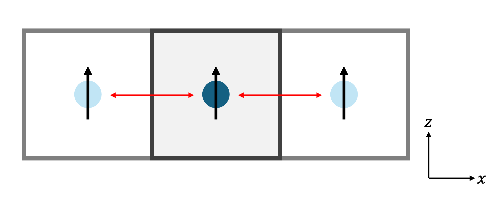
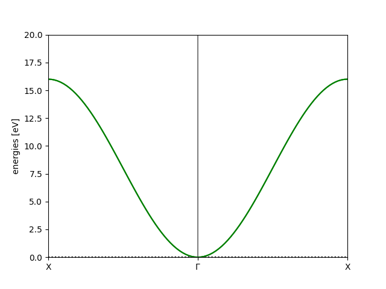

Tutorial #1: The Basics
=======================

**Aims**:

* Gain familiarity with the ASE Atoms object
* Define basic exchange interactions
* Plot a simple bandstructure

Importing the package
----------------------

First, we must import Magnon, NumPy and ASE:

.. code-block::

   import magnon
   from ase import Atoms
   import numpy as np

* NumPy is a common Python library for working with arrays of numbers.
* ASE is a library for working with unit cells describing material structures :cite:`ase2017`.

Setting up the cell
--------------------

   *The structure and interactions considered in this first example. The centre cell is the unit cell, and those to the left and right are images under the periodic boundary conditions. The black arrows show the magnetic moment vectors and the red arrows represent exchange interactions.*

Fig. 8 shows the structure we're considering in this example. We have a cubic unit cell of side length :math:`1` Angstrom, which we
define as follows. Each row is one of the lattice vectors.

.. code-block::

   lattice = np.array([[1,0,0],
                       [0,1,0],
                       [0,0,1]])

We have a single atom located in the middle of the cell, at coordinates

.. code-block::

   positions = np.array([[0.5,0.5,0.5]])

and this atom has a magnetic moment of magnitude :math:`1 \mu_B` pointing along the z-axis,

.. code-block::

   magnetic_moments = np.array([[0,0,1]])

We use these three quantities to initialise an ASE Atoms object and set its magnetic moment vectors,

.. code-block::

   atoms = Atoms("Fe", positions=positions, cell=lattice)
   atoms.set_initial_magnetic_moments(magnetic_moments)

The ASE Atoms object is used throughout Magnon for handling atomic structure, as it offers all of the core
functionality required for storing, accessing and manipulating structures in a clean and intuitive form.

Defining the interactions
-------------------------

In Magnon, the InteractionList class is used to store and process exchange coupling data. We first initialise an empty instance,
supplying our atomic structure via the ASE Atoms object,

.. code-block::

   interactions = magnon.InteractionList([], atoms=atoms)

In Figure 8, the red arrows show that the spin interacts with its own image (under periodic boundary conditions) at displacements :math:`-\hat{\mathbf{x}}` and :math:`+\hat{\mathbf{x}}` from itself. We append these interactions as

.. code-block::

   interactions.insert_interaction(0, 0, np.array([-1, 0 ,0]), np.eye(3))
   interactions.insert_interaction(0, 0, np.array([ 1, 0, 0]), np.eye(3))

where for each interaction we specify that the interaction is between the spin at index 0 and itself (the first two zeros), then the displacement
vector as above (either :math:`-\hat{\mathbf{x}}` or :math:`+\hat{\mathbf{x}}`) and then the value of the coupling, which here is an identity matrix (i.e. an isotropic exchange coupling) with coupling strength of :math:`1` eV.

Choosing the path
-----------------

A bandstructure is plotted over a path in reciprocal space. We can use ASE's :code:`Cell.bandpath()` method on a cell to generate this path.
ASE is able to access Brillouin zone data for many crystal lattices, allowing you
to specify paths in terms of the identifying letters of high-symmetry points. However, for illustrative purposes,
here we bypass this feature and create our own path from scratch,

.. code-block::

   special_points = {
      'G' : [0.0, 0.0, 0.0],
      'X' : [0.5, 0.0, 0.0],
   }

   path = atoms.get_cell().bandpath(path='XGX', npoints=100, special_points=special_points)

Here the dictionary defines the points we want our path to run between (scaled in terms of the reciprocal lattice vectors), and we then create a path which samples 100 points running
along :math:`X \to \Gamma \to X`.

Plotting the bandstructure
--------------------------

Finally, we create an instance of MagnonSpectrum using the structural information in :code:`atoms` and the coupling information
in :code:`interactions`. The MagnonSpectrum class builds the magnon Hamiltonian and can be used to compute the energies along a
bandpath:

.. code-block::

   spectrum = magnon.MagnonSpectrum(atoms, interactions)

   bstruct = spectrum.get_band_structure(path)
   bstruct.plot(emin=0, emax=20, filename='basic_bands.png')

   *The bandstructure obtained by following the steps in this tutorial.*

We obtain the plot in Figure 9. This shows the expected :math:`\mathbf{k}^2` dependence of the band around the :math:`\Gamma` point for a ferromagnet.

Full script
-----------

.. code-block::

    import magnon
    from ase import Atoms
    import numpy as np

    #def main():
    lattice = np.array([[1,0,0],
                        [0,1,0],
                        [0,0,1]])
    positions = np.array([[0.5,0.5,0.5]])
    magnetic_moments = np.array([[0,0,1]])

    atoms = Atoms("Fe", positions=positions, cell=lattice)
    atoms.set_initial_magnetic_moments(magnetic_moments)

    interactions = magnon.InteractionList([], atoms=atoms)
    interactions.insert_interaction(0, 0, np.array([-1, 0 ,0]), np.eye(3))
    interactions.insert_interaction(0, 0, np.array([ 1, 0, 0]), np.eye(3))

    special_points = {
        'G' : [0, 0, 0],
        'X' : [0.5, 0, 0],
    }

    path = atoms.get_cell().bandpath(path='XGX', npoints=100, special_points=special_points)

    spectrum = magnon.MagnonSpectrum(atoms, interactions)

    bstruct = spectrum.get_band_structure(path)
    bstruct.plot(emin=0, emax=20, filename='basic_bands.png')
