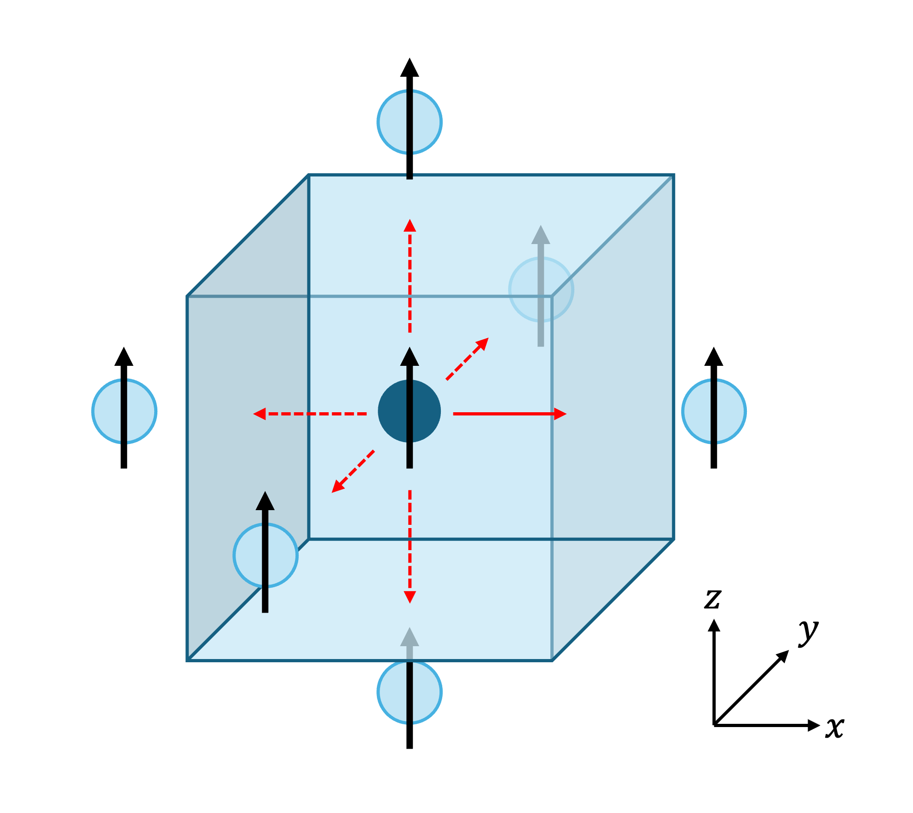
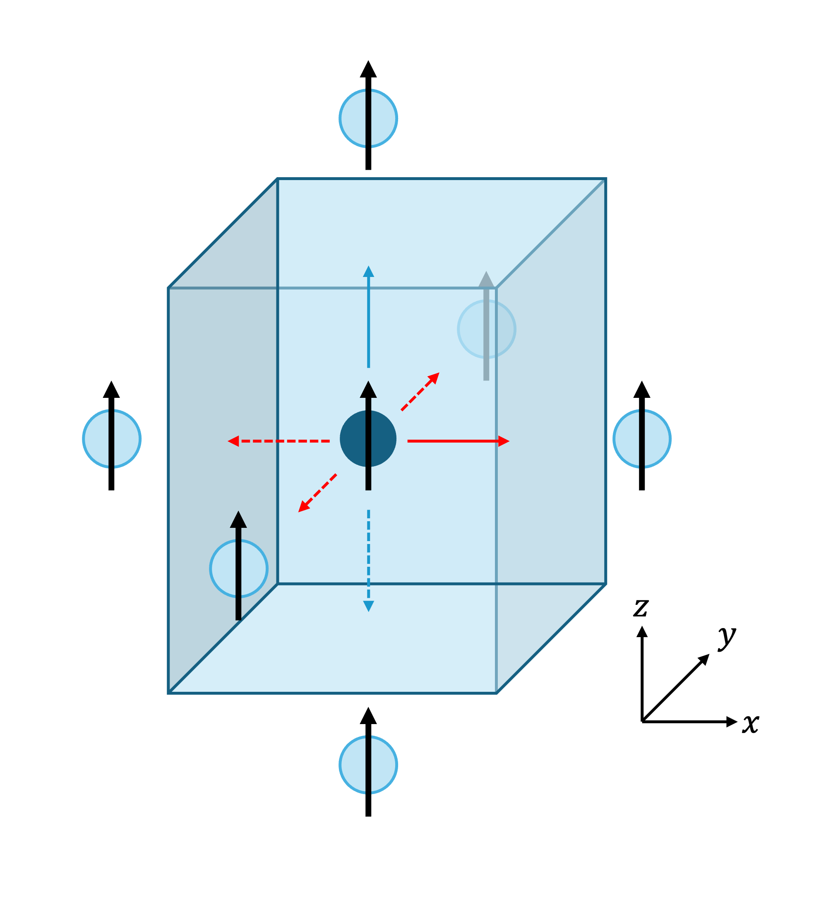

Tutorial #2: Symmetrization
===========================

**Aims**:

* Introduce the :code:`symmetrize` method of the InteractionList class
* Demonstrate generation of exchange coupling data using the symmetries of the unit cell

Setting up
----------------------

We start by importing the necessary modules, and setting up the same cell as in the first tutorial:

.. code-block::

   import magnon
   from ase import Atoms
   import numpy as np

   lattice = np.array([[1,0,0],
                       [0,1,0],
                       [0,0,1]])
   positions = np.array([[0.5,0.5,0.5]])
   magnetic_moments = np.array([[0,0,1]])

   atoms = Atoms("Fe", positions=positions, cell=lattice)
   atoms.set_initial_magnetic_moments(magnetic_moments)

Interactions from symmetry #1
------------------------------

   *A monatomic simple cubic cell, with nearest-neighbour periodic images shown. The solid arrow interaction is initially specified, and the rest are generated from symmetry.*

In the first tutorial, we set up the interactions one at a time by adding them to an :code:`InteractionList`. This is feasible for
small toy models, but for larger models we may want to specify a smaller, minimal set of couplings which can then be augmented
by the rest generated using the symmetry of the unit cell. This is especially useful for reproducing magnon bandstructures
in the literature from a table of :math:`J` values.

In this tutorial, we are considering the same unit cell as in the previous tutorial. However, as shown in Figure 10, we now
want all six nearest-neighbour interactions (i.e. we are moving to couplings in three dimensions). We start by supplying only one of these interactions:

.. code-block::

   interactions = magnon.InteractionList([], atoms=atoms)
   interactions.insert_interaction(0, 0, [ 1, 0, 0], np.eye(3))

Now we use the in-built :code:`symmetrize` method to generate the other 5 interactions:

.. code-block::

   interactions = interactions.symmetrize(atoms)

We can verify that :code:`interactions` now contains all six interactions:

.. code-block::

   for i,j,r_ij,J_ij in interactions:
       print(f"i ={i:2d}, j ={j:2d}, r_ij = ({r_ij[0]:4.1f}, {r_ij[1]:4.1f}, {r_ij[2]:4.1f}), J_ij ={J_ij[0,0]:5.2f} eV")

which prints:

.. code-block::

   i = 0, j = 0, r_ij = ( 1.0,  0.0,  0.0), J_ij = 1.00 eV
   i = 0, j = 0, r_ij = (-1.0,  0.0,  0.0), J_ij = 1.00 eV
   i = 0, j = 0, r_ij = ( 0.0,  1.0,  0.0), J_ij = 1.00 eV
   i = 0, j = 0, r_ij = ( 0.0,  0.0, -1.0), J_ij = 1.00 eV
   i = 0, j = 0, r_ij = ( 0.0, -1.0,  0.0), J_ij = 1.00 eV
   i = 0, j = 0, r_ij = ( 0.0,  0.0,  1.0), J_ij = 1.00 eV

Interactions from symmetry #2
-----------------------------

Now try changing the symmetry of the cell. Keep the script the same except for changing:

.. code-block::

   lattice = np.array([[1.0, 0.0, 0.0],
                       [0.0, 1.0, 0.0],
                       [0.0, 0.0, 1.1]])

   *The same structure as in the first part, but with the lattice stretched in the z-direction to reduce the symmetry*

Now run the script again. You will see:

.. code-block::

   i = 0, j = 0, r_ij = ( 1.0,  0.0,  0.0), J_ij = 1.00 eV
   i = 0, j = 0, r_ij = (-1.0,  0.0,  0.0), J_ij = 1.00 eV
   i = 0, j = 0, r_ij = ( 0.0,  1.0,  0.0), J_ij = 1.00 eV
   i = 0, j = 0, r_ij = ( 0.0, -1.0,  0.0), J_ij = 1.00 eV

Because of the reduced symmetry, we now only generate 3 more interactions.

Interactions from symmetry #3
-----------------------------

   *The cell from part #2 with a second interaction (solid blue arrow) added. Four new interactions are generated under symmetry (dotted arrows).*

Keeping the same stretched cell, we now add a second interaction along the z-axis, as shown in Figure 12:

.. code-block::

   interactions.insert_interaction(0, 0, np.array([0, 0, 1]), 2*np.eye(3))

Which gives, under application of symmetry:

.. code-block::

   i = 0, j = 0, r_ij = ( 1.0,  0.0,  0.0), J_ij = 1.00 eV
   i = 0, j = 0, r_ij = ( 0.0,  0.0,  1.0), J_ij = 2.00 eV
   i = 0, j = 0, r_ij = (-1.0,  0.0,  0.0), J_ij = 1.00 eV
   i = 0, j = 0, r_ij = ( 0.0,  0.0, -1.0), J_ij = 2.00 eV
   i = 0, j = 0, r_ij = ( 0.0,  1.0,  0.0), J_ij = 1.00 eV
   i = 0, j = 0, r_ij = ( 0.0, -1.0,  0.0), J_ij = 1.00 eV

The Symmetrization Procedure
----------------------------

The exchange coupling is generally complex, with many interactions for each magnetic site. However, the symmetry of the
underlying structure often ensures that many of these couplings are symmetry-equivalent. To aid the construction of
fully-symmetrised InteractionList objects, Magnon provides the option to apply these
symmetries to the object to generate the full set of couplings from a minimal descriptive set or to test that the symmetries
are satisfied. This applies the following:

1. Bond reversal symmetry

   :math:`J_{R,i,j,a,b} = J_{-R,j,i,b,a}`

   where R labels lattice vectors, {i,j} label atoms, and {a,b} label Cartesian axes. This symmetry states that the coupling
   between two sites must be the same regardless of which atom we are 'looking from'.

   .. note::

      The intrinsic symmetry is essential to ensure that the resulting linear spin wave theory Hamiltonian is Hermitian.

2. Site symmetry operations

   These are the relevant symmetry operations (derived from the space group) which apply at a particular site. They can
   be applied to a site's couplings to symmetrize them, and we iterate over all sites.

   a. First, the space group operations for the cell are obtained using Spglib :cite:`spglib2024`. This provides symmetry operations without accounting for potential screw axes and glide planes.

   b. Following Grosse-Kunstleve and Adams :cite:`grosse2002`, we compute the site symmetry group, taking
      account of possible glide planes and screw axes. This is the group of symmetry operations which leave a particular site
      invariant.

   c. We remove the translational parts, and apply the rotations to the coupling vectors to obtain other symmetric couplings from
      that site.

   .. note::

      It is important to also include nonmagnetic sites in the specification of the structure, as they may be have
      important effects on the symmetry. Magnon will automatically remove them from the bandstructure calculation later on to avoid
      additional zero modes.

3. Since the two steps above may have introduced multiple copies of some couplings, we clean out any duplicates and make sure the couplings are unique.

Bond reversal symmetry and symmetry operations
----------------------------------------------

We will now demonstrate the above steps in a brief example. We start by setting up a body-centred cubic structure:

.. code-block::

   lattice = np.array([[1,0,0],
                       [0,1,0],
                       [0,0,1]])
   positions = np.array([[0,0,0],[0.5,0.5,0.5]])
   magnetic_moments = np.array([[0,0,1], [0,0,1]])

   atoms = Atoms(["Fe", "Fe"], positions=positions, cell=lattice)
   atoms.set_initial_magnetic_moments(magnetic_moments)

as visualised below:

.. raw:: html

    

  
  

We insert a single interaction,

.. code-block::

   interactions = magnon.InteractionList([], atoms=atoms)
   interactions.insert_interaction(0, 1, np.array([0.5, 0.5, 0.5]), np.eye(3))

First, we apply the bond reversal symmetry,

.. code-block::

   interactions = magnon.interactions.apply_bond_reversal_symmetry(interactions)

   for i,j,r_ij,J_ij in interactions:
       print(f"i ={i:2d}, j ={j:2d}, r_ij = ({r_ij[0]:4.1f}, {r_ij[1]:4.1f}, {r_ij[2]:4.1f}), J_ij ={J_ij[0,0]:5.2f} eV")

and obtain two interactions, related by the expression above for :math:`J` under bond reversal.

.. code-block::

   i = 0, j = 1, r_ij = ( 0.5,  0.5,  0.5), J_ij = 1.00 eV
   i = 1, j = 0, r_ij = (-0.5, -0.5, -0.5), J_ij = 1.00 eV

We may then generate the remaining interactions under application
of the symmetry operations of the unit cell, resulting in 16 interactions in total (8 nearest neighbour interactions for each
site in the unit cell):

.. code-block::

   interactions = interactions.symmetrize(atoms)

   for i,j,r_ij,J_ij in interactions:
       print(f"i ={i:2d}, j ={j:2d}, r_ij = ({r_ij[0]:4.1f}, {r_ij[1]:4.1f}, {r_ij[2]:4.1f}), J_ij ={J_ij[0,0]:5.2f} eV")

yielding

.. code-block::

    i = 0, j = 1, r_ij = ( 0.5,  0.5,  0.5), J_ij = 1.00 eV
    i = 1, j = 0, r_ij = (-0.5, -0.5, -0.5), J_ij = 1.00 eV
    i = 0, j = 1, r_ij = (-0.5,  0.5,  0.5), J_ij = 1.00 eV
    i = 0, j = 1, r_ij = (-0.5, -0.5, -0.5), J_ij = 1.00 eV
    i = 0, j = 1, r_ij = ( 0.5,  0.5, -0.5), J_ij = 1.00 eV
    i = 0, j = 1, r_ij = ( 0.5, -0.5, -0.5), J_ij = 1.00 eV
    i = 0, j = 1, r_ij = (-0.5,  0.5, -0.5), J_ij = 1.00 eV
    i = 0, j = 1, r_ij = (-0.5, -0.5,  0.5), J_ij = 1.00 eV
    i = 0, j = 1, r_ij = ( 0.5, -0.5,  0.5), J_ij = 1.00 eV
    i = 1, j = 0, r_ij = ( 0.5, -0.5, -0.5), J_ij = 1.00 eV
    i = 1, j = 0, r_ij = ( 0.5,  0.5,  0.5), J_ij = 1.00 eV
    i = 1, j = 0, r_ij = (-0.5, -0.5,  0.5), J_ij = 1.00 eV
    i = 1, j = 0, r_ij = (-0.5,  0.5,  0.5), J_ij = 1.00 eV
    i = 1, j = 0, r_ij = ( 0.5, -0.5,  0.5), J_ij = 1.00 eV
    i = 1, j = 0, r_ij = ( 0.5,  0.5, -0.5), J_ij = 1.00 eV
    i = 1, j = 0, r_ij = (-0.5,  0.5, -0.5), J_ij = 1.00 eV

In general, it is not necessary to call :code:`apply_bond_reversal_symmetry` separately as it is called within the symmetrization
routine. The separation herein is for illustration only.

Full script
-----------

Interactions from symmetry #1:

.. code-block::

    import magnon
    from ase import Atoms
    import numpy as np

    lattice = np.array([[1,0,0],
                        [0,1,0],
                        [0,0,1]])
    positions = np.array([[0.5,0.5,0.5]])
    magnetic_moments = np.array([[0,0,1]])

    atoms = Atoms("Fe", positions=positions, cell=lattice)
    atoms.set_initial_magnetic_moments(magnetic_moments)

    interactions = magnon.InteractionList([], atoms=atoms)
    interactions.insert_interaction(0, 0, np.array([1, 0, 0]), np.eye(3))

    interactions = interactions.symmetrize(atoms)

    for i,j,r_ij,J_ij in interactions:
        print(f"i ={i:2d}, j ={j:2d}, r_ij = ({r_ij[0]:4.1f}, {r_ij[1]:4.1f}, {r_ij[2]:4.1f}), J_ij ={J_ij[0,0]:5.2f} eV")

Interactions from symmetry #2:

.. code-block::

    import magnon
    from ase import Atoms
    import numpy as np

    lattice = np.array([[1,0,0],
                        [0,1,0],
                        [0,0,1.1]])
    positions = np.array([[0.5,0.5,0.5]])
    magnetic_moments = np.array([[0,0,1]])

    atoms = Atoms("Fe", positions=positions, cell=lattice)
    atoms.set_initial_magnetic_moments(magnetic_moments)

    interactions = magnon.InteractionList([], atoms=atoms)
    interactions.insert_interaction(0, 0, np.array([1, 0, 0]), np.eye(3))

    interactions = interactions.symmetrize(atoms)

    for i,j,r_ij,J_ij in interactions:
        print(f"i ={i:2d}, j ={j:2d}, r_ij = ({r_ij[0]:4.1f}, {r_ij[1]:4.1f}, {r_ij[2]:4.1f}), J_ij ={J_ij[0,0]:5.2f} eV")

Interactions from symmetry #3:

.. code-block::

    import magnon
    from ase import Atoms
    import numpy as np

    lattice = np.array([[1,0,0],
                        [0,1,0],
                        [0,0,1.1]])
    positions = np.array([[0.5,0.5,0.5]])
    magnetic_moments = np.array([[0,0,1]])

    atoms = Atoms("Fe", positions=positions, cell=lattice)
    atoms.set_initial_magnetic_moments(magnetic_moments)

    interactions = magnon.InteractionList([], atoms=atoms)
    interactions.insert_interaction(0, 0, np.array([1, 0, 0]), np.eye(3))
    interactions.insert_interaction(0, 0, np.array([0, 0, 1]), 2*np.eye(3))

    interactions = interactions.symmetrize(atoms)

    for i,j,r_ij,J_ij in interactions:
        print(f"i ={i:2d}, j ={j:2d}, r_ij = ({r_ij[0]:4.1f}, {r_ij[1]:4.1f}, {r_ij[2]:4.1f}), J_ij ={J_ij[0,0]:5.2f} eV")

Bond reversal symmetry and symmetry operations:

.. code-block::

    import magnon
    from ase import Atoms
    import numpy as np

    lattice = np.array([[1,0,0],
                        [0,1,0],
                        [0,0,1]])
    positions = np.array([[0,0,0],[0.5,0.5,0.5]])
    magnetic_moments = np.array([[0,0,1], [0,0,1]])

    atoms = Atoms(["Fe", "Fe"], positions=positions, cell=lattice)
    atoms.set_initial_magnetic_moments(magnetic_moments)

    interactions = magnon.InteractionList([], atoms=atoms)
    interactions.insert_interaction(0, 1, np.array([0.5, 0.5, 0.5]), np.eye(3))

    interactions = magnon.interactions.apply_bond_reversal_symmetry(interactions)

    for i,j,r_ij,J_ij in interactions:
        print(f"i ={i:2d}, j ={j:2d}, r_ij = ({r_ij[0]:4.1f}, {r_ij[1]:4.1f}, {r_ij[2]:4.1f}), J_ij ={J_ij[0,0]:5.2f} eV")

    interactions = interactions.symmetrize(atoms)

    for i,j,r_ij,J_ij in interactions:
        print(f"i ={i:2d}, j ={j:2d}, r_ij = ({r_ij[0]:4.1f}, {r_ij[1]:4.1f}, {r_ij[2]:4.1f}), J_ij ={J_ij[0,0]:5.2f} eV")
