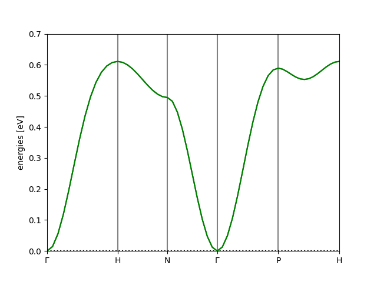
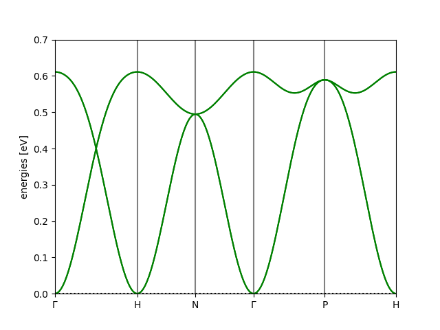

Tutorial #3: Primitivization and Paths
====================================================

**Aims**:

* Build a primitive cell from the Atoms and InteractionList objects
* Determine a suitable path in reciprocal space over which to plot a bandstructure

In the previous tutorial, we introduced a body-centred cubic cell. This cell contains two atoms, but it is not the primitive cell.
This means that the two atoms are, in fact, copies of each other, which will lead to spurious additional bands. Therefore, we build a monatomic primitive cell
from the provided diatomic conventional cell.

Initialize
-------------
As usual, we import the necessary modules:

.. code-block::

   import magnon
   from ase import Atoms
   import numpy as np

Structure and Coupling
----------------------

.. raw:: html

    

  
  

Define the BCC iron structure. We use the magnetic moment of iron which is :math:`2.2\mu_B`:

.. code-block::

    lattice = np.array([[1, 0, 0],
                        [0, 1, 0],
                        [0, 0, 1]])
    positions = np.array([[0, 0, 0], [0.5, 0.5, 0.5]])
    magnetic_moments = np.array([[0.0, 0.0, 2.2], [0.0, 0.0, 2.2]])

    atoms = Atoms(["Fe", "Fe"], positions=positions, cell=lattice)
    atoms.set_initial_magnetic_moments(magnetic_moments)

Then define a minimal set of interactions up to second nearest-neighbour:

.. code-block::

    interactions = magnon.InteractionList([], atoms=atoms)
    interactions.insert_interaction(0, 1, np.array([0.5, 0.5, 0.5]), 0.021*np.eye(3))
    interactions.insert_interaction(0, 0, np.array([1.0, 0.0, 0.0]), 0.013*np.eye(3))
    interactions.insert_interaction(1, 1, np.array([1.0, 0.0, 0.0]), 0.013*np.eye(3))

And symmetrize:

.. code-block::

   interactions = interactions.symmetrize(atoms)

Primitivization
---------------

The Atoms and InteractionList objects of the primitive cell are obtained using

.. code-block::

   atoms, interactions, _ = magnon.build.build_primitive_cell(atoms, interactions)

.. note::

   It is good practice to symmetrize the exchange interaction before primitivizing. The reverse could result in missing couplings.

Paths in Reciprocal Space
-------------------------

To analyze the magnon bandstructure of complex materials, we wish to select a high-symmetry path through the Brillouin zone
that reflects the material's underlying crystal symmetry. `SeeK-path <https://www.materialscloud.org/work/tools/seekpath>`__ is an open-source
tool that automates this process using symmetry analysis based on the material's structure. It can be used as a Python API or via the online
interface. We create a POSCAR file:

.. code-block::

   IronBCC
   1
           1.0000000000         0.0000000000         0.0000000000
           0.0000000000         1.0000000000         0.0000000000
           0.0000000000         0.0000000000         1.0000000000
      Fe
       2
   Direct
        0.000000000         0.000000000         0.000000000
        0.500000000         0.500000000         0.500000000

and upload it to SeeK-Path. The recommended path is returned:

.. math::

   \Gamma—H—N—\Gamma—P—H

which can be supplied to an ASE bandpath with the Atoms object to generate the path:

.. code-block::

   path = atoms.get_cell().bandpath(path='GHNGPH', npoints=60)

We can finally initialize the MagnonSpectrum object with the structure and interactions, and plot the bandstructure:

.. code-block::

    spectrum = magnon.MagnonSpectrum(atoms, interactions)

    bstruct = spectrum.get_band_structure(path)
    bstruct.plot(emin=0, emax=0.7, filename='Iron_BCC_bands.png')

Full script
-----------

The combined script for all of the above is

.. code-block::

   import magnon
   from ase import Atoms
   import numpy as np

   lattice = np.array([[1, 0, 0],
                       [0, 1, 0],
                       [0, 0, 1]])
   positions = np.array([[0, 0, 0], [0.5, 0.5, 0.5]])
   magnetic_moments = np.array([[0.0, 0.0, 2.2], [0.0, 0.0, 2.2]])

   atoms = Atoms(["Fe", "Fe"], positions=positions, cell=lattice)
   atoms.set_initial_magnetic_moments(magnetic_moments)

   interactions = magnon.InteractionList([], atoms=atoms)
   interactions.insert_interaction(0, 1, np.array([0.5, 0.5, 0.5]), 0.021*np.eye(3))
   interactions.insert_interaction(0, 0, np.array([1.0, 0.0, 0.0]), 0.013*np.eye(3))
   interactions.insert_interaction(1, 1, np.array([1.0, 0.0, 0.0]), 0.013*np.eye(3))

   interactions = interactions.symmetrize(atoms)
   atoms, interactions, _ = magnon.build.build_primitive_cell(atoms, interactions)

   path = atoms.get_cell().bandpath(path='GHNGPH', npoints=60)

   spectrum = magnon.MagnonSpectrum(atoms, interactions)

   bstruct = spectrum.get_band_structure(path)
   bstruct.plot(emin=0, emax=0.7, filename='Iron_BCC_bands.png')

Result
------

The following figure shows the resulting Iron BCC magnon bandstructure:

Spurious Folded Bands
---------------------

Now consider what we would have obtained without the primitivization step. Consider the full script:

.. code-block::

    import magnon
    from ase import Atoms
    import numpy as np

    lattice = np.array([[1, 0, 0],
                        [0, 1, 0],
                        [0, 0, 1]])
    positions = np.array([[0, 0, 0], [0.5, 0.5, 0.5]])
    magnetic_moments = np.array([[0.0, 0.0, 2.2], [0.0, 0.0, 2.2]])

    atoms = Atoms(["Fe", "Fe"], positions=positions, cell=lattice)
    atoms.set_initial_magnetic_moments(magnetic_moments)

    interactions = magnon.InteractionList([], atoms=atoms)
    interactions.insert_interaction(0, 1, np.array([0.5, 0.5, 0.5]), 0.021*np.eye(3))
    interactions.insert_interaction(0, 0, np.array([1.0, 0.0, 0.0]), 0.013*np.eye(3))
    interactions.insert_interaction(1, 1, np.array([1.0, 0.0, 0.0]), 0.013*np.eye(3))

    interactions = interactions.symmetrize(atoms)
    prim_atoms, prim_interactions, _ = magnon.build.build_primitive_cell(atoms, interactions)

    path = prim_atoms.get_cell().bandpath(path='GHNGPH', npoints=180)

    spectrum = magnon.MagnonSpectrum(atoms, interactions)

    bstruct = spectrum.get_band_structure(path)
    bstruct.plot(emin=0, emax=0.7, filename='Iron_BCC_bands_folded.png')

We keep the primitivization, but only use it to calculate the reciprocal space path - this ensures we are consistent with the
horizontal axis of the plot. For the magnon bandstructure, we used the
conventional two-atom cell. This results in the bands:

This is the same as the first bandstructure plot, only the bands are 'folded over' to give a second, spurious copy. This is
misleading, and shows the importance of using a minimal cell; it is flawed to treat periodic images as distinct atoms.