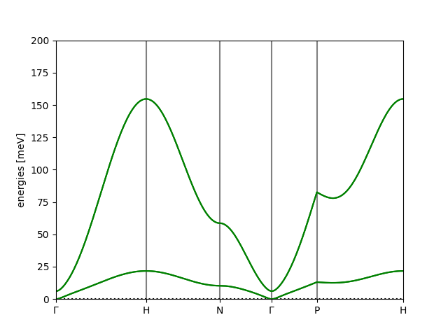

Tutorial #4: File Reading and Antiferromagnets
==============================================

**Aims**:

* Set up a structure using input files rather than by hand
* Work with antiferromagnetic structures
* Extract raw bandstructure data

In this example, we'll use an iron-gadolinium toy model:

.. raw:: html

    

    
    

Initialize
----------

.. code-block:: python

   import magnon

Structure Inputs
----------------

Magnon makes good use of ASE, and this includes its I/O capabilities. The unit cell structure
can be read directly into an Atoms object using e.g. :code:`ase.io.read()` with any of the standard structure file formats allowed by that function.
In this example, we read from a POSCAR file :code:`FeGd.poscar`:

.. code-block::

    FeGd
    1
            1.0000000000         0.0000000000         0.0000000000
            0.0000000000         1.0000000000         0.0000000000
            0.0000000000         0.0000000000         1.0000000000
       Fe	Gd
        1	 1
    Direct
         0.000000000         0.000000000         0.000000000
         0.500000000         0.500000000         0.500000000

.. code-block::

   atoms = ase.io.read("FeGd.poscar")

Since not all of these file formats will allow the inclusion of magnetic moment information, and to allow flexibility in
the set-up of these quantities, the magnetic moments may be read in from a separate file using :code:`magnon.input.read_site_spin_data`,
which takes a file containing the magnitudes and directions of the magnetic moments, :code:`FeGd_moments`,

.. code-block:: text

   # magmom sx sy sz
     3.0     0  0  1
     7.0     0  0 -1

.. code-block::

   magmoms, directions = magnon.input.read_site_spin_data("FeGd_moments")
   atoms.set_initial_magnetic_moments(magmoms[:, np.newaxis] * directions)

The spin quantum number or magnetic moment may be specified by changing the *magmom_scaling* factor. To specify magnetic moments in
the input file, the scaling should be :math:`1`. When specifying spin quantum numbers, it should be :math:`2`.

Exchange coupling inputs
------------------------

The exchange coupling may be imported from a file :code:`FeGd_exchange` with the format,

.. code-block:: text

   # i j  vector        J
     1 1  1.0 0.0 0.0  18
     2 2  1.0 0.0 0.0   5
     1 2  0.5 0.5 0.5  -2

This format matches that returned by many codes used to compute exchange couplings. This is read in the form required to initialise an :code:`InteractionList` via
:code:`magnon.interactions.read_interactions`:

.. code-block::

   interactions = magnon.interactions.read_interactions("FeGd_exchange")
   interactions = magnon.interactions.InteractionList(interactions, atoms=atoms)

.. note::

   Magnon also supports tensor coupling for more complicated spin interactions. These are specified by nine entries after
   the vector, rather than the single entry for a scalar (isotropic) interaction.

Reading in a single line
------------------------

All of the above can be achieved more compactly using

.. code-block::

   atoms, interactions = magnon.input.create_interacting_system('FeGd.poscar', 'FeGd_moments', 'FeGd_exchange',)

Getting the bandstructure
-------------------------

The rest of the process proceeds along the lines we have already seen in previous tutorials; here we manually set the high-symmetry points as
we did in the very first tutorial:

.. code-block::

    interactions = interactions.symmetrize(atoms)

    special = {
        'G': [0,0,0],
        'H': [0.5,-0.5,0.5],
        'N': [0,0,0.5],
        'P': [0.25,0.25,0.25],
    }

    path = atoms.get_cell().bandpath(path='GHNGPH', npoints=240, special_points=special)

    spectrum = magnon.MagnonSpectrum(atoms, interactions, ham_prefactor=1)

    bstruct = spectrum.get_band_structure(path)
    bstruct.plot(emin=0, emax=200, filename='FeGd_bands.png')

yielding

Extracting the bandstructure data
---------------------------------

We can extract the reciprocal space path points and corresponding band energies from the BandStructure object as:

.. code-block::

   k_points = bstruct.path.cartesian_kpts()
   bands = bstruct.energies

and we can write the bandstructure to a JSON file using:

.. code-block::

   bstruct.write("FeGd_bands.json")

which allows you to use the raw data to generate your own plots or analyses.

Full script
-----------

.. code-block::

    import magnon

    atoms, interactions = magnon.input.create_interacting_system('FeGd.poscar', 'FeGd_moments', 'FeGd_exchange',)
    interactions = interactions.symmetrize(atoms)

    special = {
        'G': [0,0,0],
        'H': [0.5,-0.5,0.5],
        'N': [0,0,0.5],
        'P': [0.25,0.25,0.25],
    }

    path = atoms.get_cell().bandpath(path='GHNGPH', npoints=240, special_points=special)

    spectrum = magnon.MagnonSpectrum(atoms, interactions, ham_prefactor=1)

    bstruct = spectrum.get_band_structure(path)
    bstruct.plot(emin=0, emax=200, filename='FeGd_bands.png')

    k_points = bstruct.path.cartesian_kpts()
    bands = bstruct.energies

    print(k_points[0], bands[0][0])

    bstruct.write("FeGd_bands.json")

